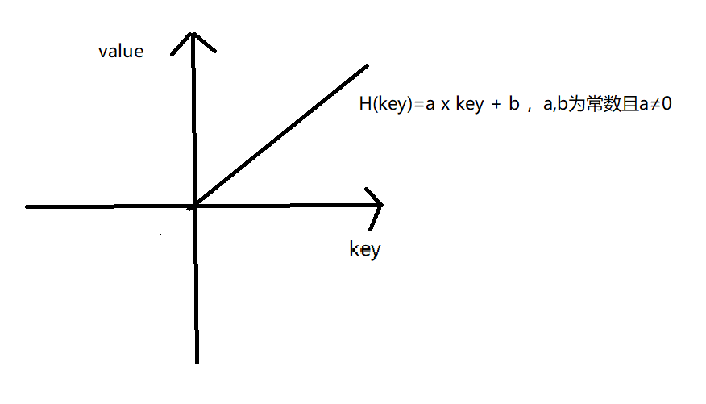
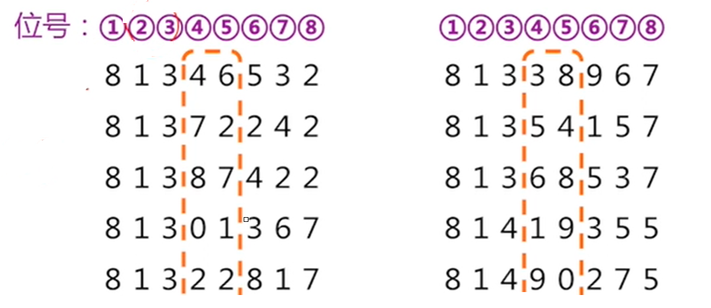
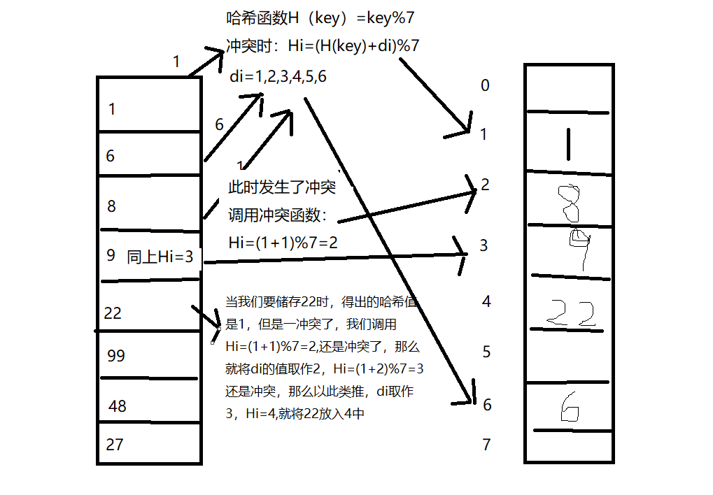
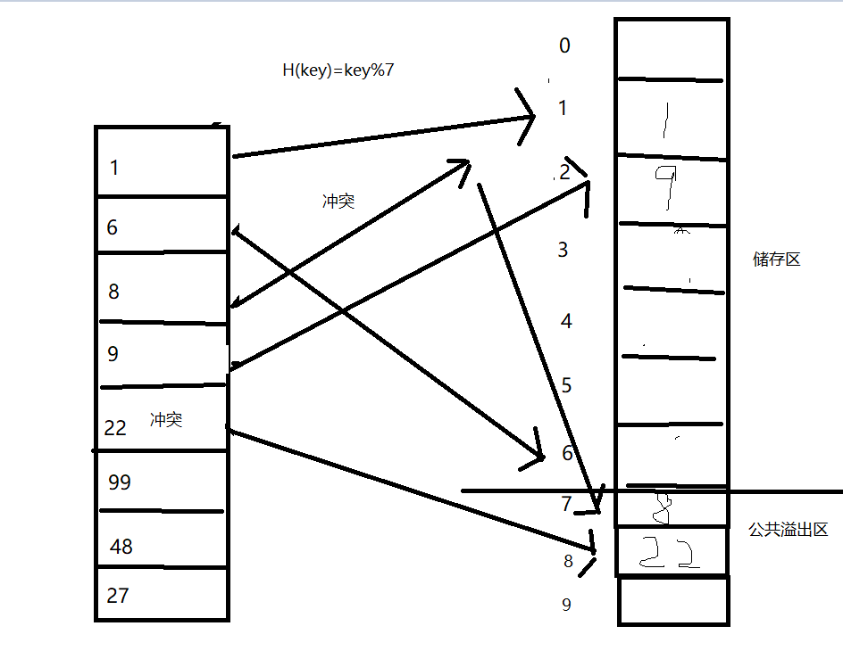

# 哈希表

## 一、定义：

- 哈希表，也成为==散列表==，是根据键值对（key,value）来==进行查询访问的==一种==数据结构==。

- 是一种查找数据的方法和手段

- 在传统查找数据方法中，我们通常通过关键字值间的比较来查询内容，但是这种方法，速度很慢，效率不高。那么有没有==不通过关键字值的比较==就能==查询内容==的呢？没错，就是哈希表。

- 根据设定的 ==哈希函数==以及==处理冲突的方法==将查取表中各数据元素存储在一段有限的连续空间中，就可以获得哈希表。

  tips：尽可能构造一个好的哈希函数，冲突少一点，但是==冲突不可避免==，因此需要有解决冲突的办法。

## 二、构建函数基本要求：

​     设关键字集K中有n个关键字，哈希表长为m，即哈希表地址集为[0,m-1]，则哈希函数H应满足：

- 对任意K~i~∈K，i=1,2,....,n,则0≤H(k~i~)≤m-1;
- 对任意K~i~∈K,H(k~i~)取[0,m-1]中任意值的概率相等

## 三、常见的方法：

### 1、直接定址法

取关键字key的一个线性函数作为哈希函数，即：H(key)=a x key + b,其中a,b为常数且a≠0；

### 2、数字分析法

若关键字是r进制数，则预知全部可能出现的关键字值，则可取关键字中若干位构成哈希地址

举例：要在长度100的哈希地址中空间中保存80个数据元素，部分元素如下，用数字分析法来设计函数

- 公式：H(key)=key%100000/1000

  

在上图给出的数据中，4，5，6，7这四个位号出现的哈希地址冲突最少，因为可以选用这几个位号来计算哈希值

### 3、平方取中法

如果关键字较短，则先对关键字值求平方，然后取运算结果的中间几位为哈希地址。

### 4、折叠法

举例：一座图书馆有不高于一万本藏书，需要通过编号来设计哈希函数

- 移位叠加：设有编号8123456556，由低到高每四位叠一位，得到四个数字6556，2345，81，将这三个数相加8982，因此就将这本书放在8982上。

- 间界叠加：设有编号8123456556，由低到高每四位叠一位，得到四个数字6556，5432，81，将三个数相加等于12069，因为超过了一万，一次去除进位，那么就将这本书放在2069上。

### 5、除留余数法

举例：设有一组关键字：（2，3，6，9，8，18，10，36），用除留余数法设计哈希函数

假设值为x，那么H(key)=key%x,在这里，我们要对x进行限制，这个x要为质数

- 取质数的原因:假设我么取x为4，那么取余就会是（0，3，2，1，0，2，2，0），由此可见，会增加哈希值冲突的可能

## 四、处理冲突的基本方法：

定义：处理哈希冲突的方法其实很简单，就是当要存储的值计算出的哈希地址已经被占用，那么就按照其他的算法计算下一个哈希值，直到找到可以储存到的哈希地址值

### 1、开放定址法

令H~i~=(H(key)+d~i~)%m , i =1,2,3,....,m-1,H(key)为哈希函数，m为哈希表长，d~i~为增量序列

- 如果d~I~=1,2,3...,m-1，则成为==线性探测再散列==

  

- 如果d~i~=1,-1^2^,2^2^,-2^2^,.....,±k^2^==二次探测再散列==,与上一个除了d~i~有变化外，其他逻辑不变

- 如果d~i~=伪随机序列，就称为==伪随机探测再散列==

### 2、链地址法

将所有按给定的哈希函数求得的哈希地址相同的关键字存储在同一线性链表中，且使链表按关键字有序

数组+链表，hashmap的结构就是这种方法的延申。

### 3、公共溢出区法

若关键字所对应的hash地址已经被占用，则保存到公共溢出区中

## 五、在哈希表中查找元素

- 根据待查关键字值，按照哈希函数，求出哈希地址值
- 如果地址上没有数据元素，则查找失败
- 如果有数据元素，则进行关键值间的比较
  - 若成功，则查找成功
  - 若不等，则按冲突方法求下一个可能的存储地址

## 六、结尾

虽然哈希表在关键字值与存储位置间建立了映像，但由于冲突的存在，仍然需要进行关键字间的比较，因此仍以成功时的平均查找长度和查找不成功时的比较次数作为衡量查找效率的依据。